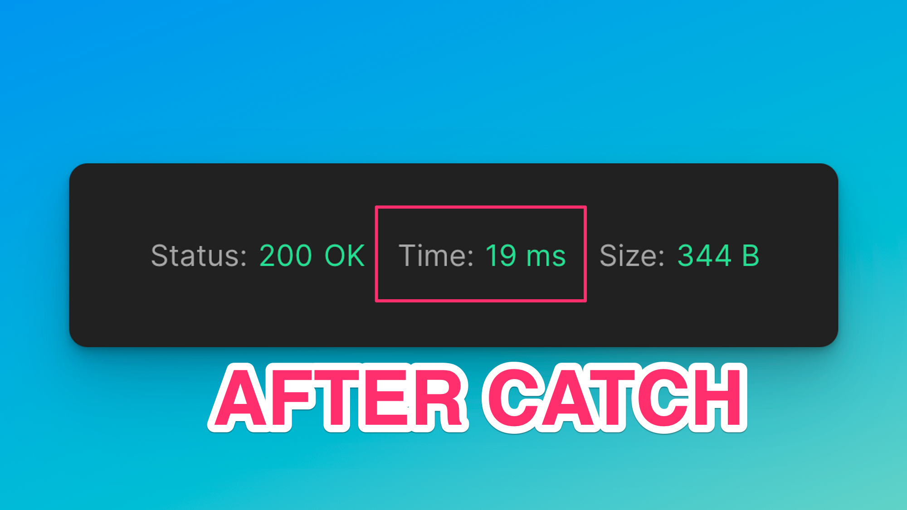

<p align="center">
  

</p>
<p align="center">
  <b>
    ⚾️ Catch ⚾️
  </b>
  <br/>
  <i>An RPC cache for 10x faster requests</i>
  <br/>
</p>

<br/>




<br/>

## ⚾️ Catch: Ethereum RPC Caching Made Simple

We hit Ethereum nodes thousands of times a day. Some functions take seconds to resolve, yet they are immutable. If the result is immutable why do we ever recompute it?

Now we don't!

> Catch is a global RPC cache for the entire world to use EVM Chains faster

<br/>

## 🌟 FAQ: Frequently Asked Questions

<details>
<summary><b>🤖 Q: How does it know what to catch?</b></summary>
<p>🅰️ The catch requirements can be specified via a smart-contract that is crowd-sourced. Each chain has its own `CatchManager` deployed, so users on each chain can decide which contracts and functions are worth caching.</p>
</details>
<details>
<summary><b>💸 Q: Does this save me credits?</b></summary>
<p>🅰️ YES. Alchemy, Infura, and other providers charge you per-request. If Catch finds a match for your request already in the cache, that data is returned before ever using your credits!</p>
</details>
<details>
<summary><b>⏰ Q: Does this save me time?</b></summary>
<p>🅰️ YES. It is much faster to resolve a cached version than to compute a value dynamically via a function in a smart-contract. <b>The time saving is often over 1 second!</b></p>
</details>
<details>
<summary><b>⛓️ Q: What chains does this support?</b></summary>
<p>🅰️ All Ethereum chains can be easily adopted by forking this repo and deploying a new `CatchManager`. That said, the easier way is to add in high-volume cache heuristics via the `cacheableConfig` directly in the typesript codebase. (more information coming soon)</p>
</details>
<summary><b>♻️ Q: Does this affect the envionment?</b></summary>
<p>🅰️ YES. By returning cached results, we save networking bandwidth and decrease energy usage</p>
</details>

## Smart-Contract Managers Deployed Across:

- [Polygon mainnet](https://polygonscan.com/address/0xcbbb04fde79e40e98d6c49b539abd60858c7b525)
- [Celo Alfajores Testnet](https://explorer.celo.org/alfajores/address/0x70842AcB25e4381A24D489d6d3FB656C634f97eD)
- [Gnosis Chain](https://blockscout.com/xdai/mainnet/address/0x70842AcB25e4381A24D489d6d3FB656C634f97eD)
- [Taiko Hackathon L2](https://l2explorer.hackathon.taiko.xyz/address/0x70842AcB25e4381A24D489d6d3FB656C634f97eD/contracts#address-tabs)
  <!-- - [Scroll Alpha Testnet]() -->
  <!-- - [Linea]() -->
  <!-- - [Optimism]() -->

## Example Fetches

Polygon fetch (cached thanks to the deployed smart-contract):

```sh
curl --location 'http://127.0.0.1:3002/api/rpc?rpc=https%253A%252F%252Ffree-eth-node.com%252Fapi%252Fmatic&chainId=137' \
--header 'Content-Type: application/json' \
--data '{
    "jsonrpc": "2.0",
    "id": 4,
    "method": "eth_call",
    "params": [
        {
            "to": "0x7ffb3d637014488b63fb9858e279385685afc1e2",
            "data": "0x626381a0"
        },
        "latest"
    ]
}'
```

Example mainnet fetch

```sh
curl --location 'http://127.0.0.1:3001/api/rpc?rpc=https%253A%252F%252Ffree-eth-node.com%252Fapi%252Feth' \
--header 'Content-Type: application/json' \
--data '{
    "jsonrpc": "2.0",
    "id": 1,
    "method": "eth_call",
    "params": [
        {
            "data": "0x9e34070f0000000000000000000000000000000000000000000000000000000000000002",
            "to": "0x090d4613473dee047c3f2706764f49e0821d256e"
        },
        "latest"
    ]
}'
```

## Extra Information

Solidity contract is viewable at https://github.com/dawsbot/catch-solidity
